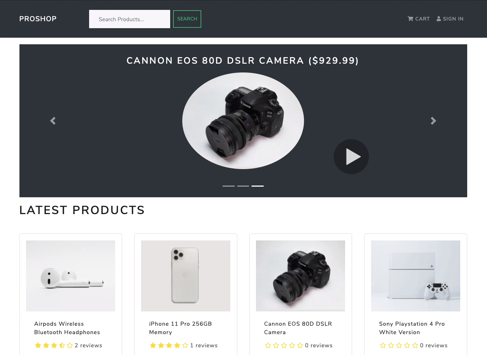

# myMarketplace | MERN E-Commerce Platform

A full-stack e-commerce application platform built with the React, Redux, MongoDB, and Express. The app is currently under development.

## Motivation

With the massive industry that is e-commerce, it only felt natural to devote time to developing and understanding a full-stack e-commerce platform. As such, I decided to follow [Brad Traversy's Udemy MERN Stack E-Commerce](https://www.udemy.com/course/mern-ecommerce/) course and gain an in-depth understanding of this very common design pattern.

## App Features

- Full featured shopping cart
- Product reviews and ratings
- Top products carousel
- Product pagination
- Product search feature
- User profile with orders
- Admin product management
- Admin user management
- Admin Order details page
- Mark orders as delivered option
- Checkout process (shipping, payment method, etc)
- PayPal / credit card integration
- Database seeder (products & users)

## License

The MIT License
